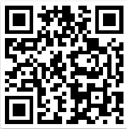
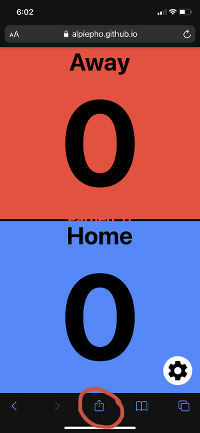
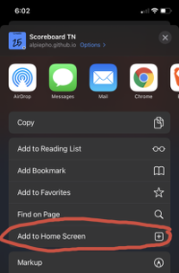
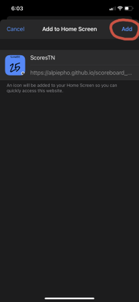

## Get Application
Version: 2.2

GH-Pages site: https://alpiepho.github.io/scoreboard_tap_tn2/

or QR Code:

## scoreboard_tap_tn2
Flutter app to display ScoresTN2 (scorebaord_tn2) data from a ScoresReflectorTN2 (scoreboard_reflector_tm2)

The ScoresTN2 is a PWA for scoring youth sports, like volleyball.  Typically, one person keeps score on a smart phone, flashing the on going score to a video recording, or to other spectators.

Two problems occur:
1. The score keeper may not always show the score
2. The display on the phone may not be large enough

This application monitors a reflector that is populated by the ScoresTN2 application.  This allows this application to display a running update of one or more games.

NOTE: Since the first use is for Volleyball, there may be Volleyball specifics within the application.

## INSTALL ON IPHONE

This application is a Web application known as a PWA (progressive web application).  It is possible to add a PWA to the home screen of an iPhone
like it is a downloaded application (there is a similare mechanism for Android that is not discused here).  Use the following steps:

NOTE: images are from Scores app, but still illustrate the process.

1. Open the above link in Safari and click on up-arrow

2. Click on "Add to Home Screen"

3. Select "Add"

### KNOWN ISSUES

A PWA on iPhone requires internet access to launch the first time.  However, once it is running, the application will work fine without and an internet connection.

## ABOUT

This is a companion application to the ScoresTN2 application.  That app is a simple
scoreboard applications.  Recently, it was modified to post each score change to a
 simple server (a refelector if you will).  The Tap application reads from that server
 and shows a mirror of the current score.  It can also show a stream of scores,
 completee with the colors and other details.

## BASIC USAGE

The application from the above URL will open a respoonsive web page.  It is best viewed on a mobile phone with the most testing on and iPhoneX.  If opened on iPhone Safari, you can used the middle bottom button to add to the Home Screen (as a PWA).

The application opens with two large colored buttons for two teams.  It also has 3
floating buttons, refresh, switch mode (stream/scores) and settings.

The settings dialog allows some quick actions from icons at the top: clear scores, swap teams, and a done checkmark to save settings listed below.  All saved settings are added to the persistent storage so the next launch will read them and the user can pick up where they left off.

The settings dialog also allows selecting the reflector server and which score keeper
to track.

Back on the score page, the refesh button will change the score state to the latest
state from the reflector. 

Toggling the mode button will take to the stream page (actually implemented as a
full page modal)).  This provides either a raw list of scores from the reflector, or
a small color list of scores.  Most recent first.  Use the Settings page to control
what is shown.

Below are some lists of things yet to do and possible future changes.

Thanks for trying out this applications.

## KNOWN BUGS

- have seen page go black due to some sequence of refresh.  Restart the app
- have seen wrong mode appear, again restart the app
- settings changes for raw stream don't change the stream page immediately.  Toggle 
mode.

## TODO AND FUTURE CHANGES
- [x] copy and modify for tap
- [x] review/update README
- [ ] new install images
- [x] fix QR
- [x] strip down settings page
- [x] strip down engine
- [x] remove gesture from boxes
- [x] add refesh button
- [x] clean up un wanted code (can always diff with scores)

- [x] settings for stream mode
- [x] stream page/modal
- [x] stream text
- [x] stream color
- [-] latest only

- [x] read from reflector
- [x] show comment with dialog
- [x] send comments?
- [x] think about security of sending comments
- [x] review/clear commented out code

- [x] show QR for this app
- [x] show QR for ScoresTN2
- [x] add shows to ScoresTN2

- [ ] timer for scores refresh?
- [ ] style for alert dialogs (scores app only?)
- [ ] refactor duplicate code sections
- [ ] apply new fonts to stream, or remove??, or from reflector?
- [ ] size 13
- [ ] fix engine save/get, add version check
- [ ] fix font size stream (too small)

- [ ] build ios
- [ ] ios developer install
- [ ] ios store?

- [ ] check save scorer
- [ ] settings: make buttons more obvious
- [ ] settings: refactor
- [ ] settings default link?  copy paste on phone?
- [ ] double check QR codes
- [ ] remove version 1 of scores
- [ ] longer time on reflector?
- [ ] apple watch?
- [ ] Jason was delay

## APPENDIX: How to outline Repaint

<pre>
void main() {
  // --> debugRepaintRainbowEnabled = true;
  runApp(Scoreboard());
}
</pre>

## REFERENCES

Icons created with https://appicon.co/  NOTE: original image should be square to avoid white edges on IOS Home screen.

QR code generated with https://www.the-qrcode-generator.com/.  Used screen capture to save qrocode.png and copied file here.

- https://github.com/alpiepho/scoreboard_tn2
- https://github.com/alpiepho/scoreboard_reflector_tn2
- https://github.com/alpiepho/scoreboard_tap_tn2

